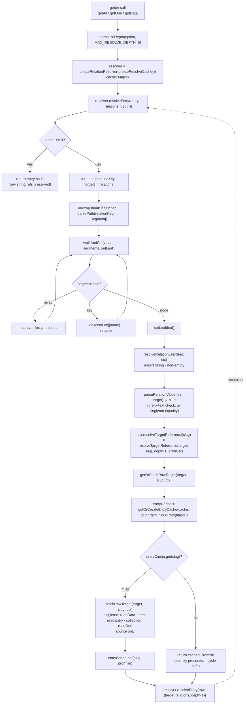
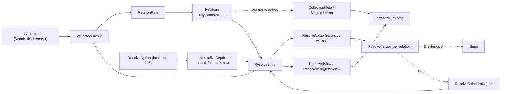

# Relationships

**Status:** stable
**Version:** v1

## Intent

Managing relationships between collections is the single biggest pain point for plain Markdown CMSes. Qino's job is to make it ergonomic both at the schema level (declaring a relation) and at the getter level (resolving it).

Three things the developer must be able to express:

1. That a string field is a path to another collection's entry.
2. That the target file has a specific extension.
3. Whether the field resolves to one entry or many.

## API

Relations are declared on `createCollection`, `createTree`, or `createSingleton` via a `relations` map. Schemas stay vanilla — no augmentation, no custom helpers. The target's path and extension are read off the referenced primitive (single source of truth).

```ts
import { createCollection } from "qino";
import z from "zod";
import { authorCollection } from "./authors";
import { categoryCollection } from "./categories";

const PostSchema = z.object({
  title: z.string(),
  author: z.string(), // 1:1
  categories: z.array(z.string()), // 1:n
});

export const postCollection = createCollection({
  directory: "/posts",
  schema: PostSchema,
  extension: ".md",
  relations: {
    author: authorCollection,
    "categories[*]": categoryCollection,
    // Forward refs / cycles use thunks:
    // featured: () => postCollection,
  },
});
```

### How the three things are expressed

1. **String → a collection, tree, or singleton.** The value at the relation key (`author: authorCollection`) is the target primitive. Its path and extension live on the target — Qino reads them at build time.
2. **Target extension.** Carried by the referenced collection's `extension` field; not redeclared.
3. **Cardinality.** Derived purely from the relation key (the JSON path). Any `[*]` anywhere in the key → `"many"`; otherwise `"one"`. `[*]` is transitive — `articles[*].author` is `"many"` even though the leaf is a single field. No build-time data scan is needed.

The relation key is type-checked against the schema's output shape (string leaves only) — see [Typesafety](#typesafety) for the full picture.

## Lock-file representation

`qino build` walks each registered collection, validates every entry, and emits the lock file:

```json
"relations": [
  { "field": "categories[*]", "target": "/categories", "kind": "collection", "cardinality": "many" },
  { "field": "author",        "target": "/authors",    "kind": "collection", "cardinality": "one"  }
]
```

`field` is the relation key verbatim — `[*]` segments preserved. `kind` is `"collection"`, `"tree"`, or `"singleton"` depending on what the relation points at; consumers reading the lock file use it to decide whether to look up the target in the `collections`, `trees`, or `singletons` section. `cardinality` is derived from the path itself (no data scan); the consumer never writes either of these by hand.

## Relation value format

A relation field in a content file stores the **full path of the target entry relative to `contentFolder`**: the target collection or tree's folder, the slug, and the target's extension.

```yaml
# src/content/posts/hello.md frontmatter
author: "authors/jane-doe.json"
categories:
  - "categories/architecture.json"
  - "categories/philosophy.json"
```

At resolve time, for a **collection or tree target** the resolver:

1. Asserts the value is under the target's `directory` (leading `/` is tolerated on the value).
2. Asserts the value ends with the target's `extension`.
3. Strips both and passes the remaining slug to the target's internal `readOne(slug)` (collection) or `readEntry(slug)` (tree).

A mismatched prefix, a mismatched extension, or an empty string throws at resolve time with the source `_meta.filePath`, the relation key, and the offending value. Bare slugs (e.g. `author: "jane-doe"`) are **not** accepted — the verbose form is the only valid format. This trades a few extra characters per entry for self-documenting frontmatter and prefix-mismatch detection at the boundary.

For a **tree target**, `docs/guides/setup.md` resolves the entry with slug
`guides/setup`. The result contains schema fields and `TreeEntryMeta`, with no
children or navigation data. Reading the target bypasses its views and augment;
the source view's remaining depth controls its outgoing relations. All three
primitive types can be sources and targets, including tree-to-tree references.

For a **singleton target** (see [03-singletons.md](03-singletons.md)), the value must equal the target singleton's `file` exactly (leading `/` is tolerated). The prefix+extension pair collapses to a single equality check because a singleton has exactly one file. On match the resolver calls the singleton’s internal source reader; on mismatch it throws naming the expected file, the relation key, and the source file path.

## Build pipeline guarantees

`qino build` enforces two invariants per collection:

1. **All entries validate.** Any schema failure throws with the offending file path.
2. **Folder is non-empty.** Zero entries → throw. A collection must have at least one entry.

## Resolution

When the selected view enables resolution, `getAll`, `getOne`, `getEntry`, and `getData` run a single-pass traversal that walks each declared relation, swaps the `string` leaf for the fully-resolved target entry, deduplicates fetches via a per-call cache, and bottoms out at the depth normalized from `resolveRelations`. The result is a fully-typed entry tree where every reachable relation (up to the configured depth) is materialized in-place — no follow-up getter calls, no manual joins.

### `resolveRelations` option

Accepts:

- `true` — resolve everything reachable, up to `MAX_RESOLVE_DEPTH` (currently `6`).
- `1 | 2 | 3 | …` — resolve up to N levels. Values above 6 clamp to 6; negatives and non-integers floor-and-clamp into `[0, 6]`.
- (default) `false` — return raw string paths.

Set inside `views.default` or a custom view on any primitive—a fixed depth paired
with that view’s augmentation. Root resolution settings are forbidden.

Getters accept `{ view: "name" }` to select a declared custom view, or no option
for the declared default, or raw references when views are omitted. Per-call depth overrides are removed; see [15-views](./15-views.md).

> Reverse traversal (an author gaining a `posts` array of every entry that references them) is deferred to v2 — see [14-upstream-resolution.md](14-upstream-resolution.md).

### Pipeline



Three properties to internalize from this graph:

- **Depth decrements once per relation boundary** — bound into the per-relation `resolveTargetReference(slug)` closure as `depth - 1`, not per JSON-path segment. `articles[*].author` walks array+field within a single hop and only spends one depth unit when `author` is dereferenced.
- **The cache is per-call**, fresh on every `getAll` / `getOne` / `getEntry` / `getData` invocation. Two-level: outer keyed by `getTargetUniquePath(target)` (`meta.directory` for collections and trees, `meta.file` for singletons), inner keyed by slug → `Promise<AnyEntry>`.
- **Recursion is owned by one resolver**: `resolver.resolveEntry → resolveTargetReference → getOrFetchRawTarget → resolver.resolveEntry`. The leaf helpers (`resolveRelationLeaf`, `parseRelationValue`, `fetchRawTarget`) are pure of recursion — they validate, parse, or fetch and hand back. Cycle safety comes from `getOrFetchRawTarget` storing the Promise _before_ it settles (see [Cache, identity, and cycles](#cache-identity-and-cycles)).

### Worked example: depth=2

Setup:

```ts
postCollection: {
  directory: "/posts",
  relations: { author: authorCollection, "categories[*]": categoryCollection },
}
authorCollection: { directory: "/authors", relations: { mentor: authorCollection } }
categoryCollection: { directory: "/categories", relations: {} }
```

Source entry:

```yaml
# /posts/hello.md
title: "Hello"
author: "authors/jane.json"
categories: ["categories/a.json", "categories/b.json"]
```

Trace:

1. `postCollection.getOne("hello", { view: "detail" })` with `views.detail.resolveRelations: 2` → `normalizeDepth(2) = 2`. Fresh cache + resolver created.
2. `resolver.resolveEntry(post, { depth: 2 })`. Iterate post's two relations.
3. **Relation `author`.** `parsePath("author") = [{kind:"key", name:"author"}]`. `walkAndSet` descends into `obj.author`; no more segments → calls `setLeaf("authors/jane.json")`.
4. `resolveRelationLeaf` validates non-empty string → `parseRelationValue` strips prefix `/authors/` and extension `.json` → slug `"jane"`. Calls the bound `ctx.resolveTargetReference("jane")` → `resolveTargetReference(authorCollection, "jane", 1, errorCtx)`.
5. `getOrFetchRawTarget` builds `entryCache` under `getTargetUniquePath = "/authors"`. Miss for `"jane"` → `fetchRawTarget` calls the author collection’s internal `readOne("jane")` → raw author. The in-flight Promise is set on `entryCache` _before_ awaiting (cycle-safety pin).
6. Re-enters `resolver.resolveEntry(janeRaw, { depth: 1, relations: { mentor: authorCollection } })`. Author has `mentor: "authors/bob.json"` → bound `resolveTargetReference("bob")` with `depth - 1 = 0`.
7. Cache miss for `("/authors", "bob")` → `fetchRawTarget` returns raw bob. Recursive `resolver.resolveEntry(bobRaw, { depth: 0 })` short-circuits at the `depth <= 0` guard → returns bob as-is. `bob.mentor` stays a `string`.
8. **Relation `categories[*]`.** Segments `[{key:"categories"}, {array}]`. `walkAndSet` descends into `categories`, then map-recurses each element, each bottoming out at `setLeaf`. Each leaf → bound `resolveTargetReference(slug)` with `depth=1`. Categories have empty `relations`, so the nested `resolver.resolveEntry` finds nothing to walk and returns the raw entry unchanged.

Final shape: `post.author` is a full author whose `mentor` is a full bob (whose own `mentor` is still a string); `post.categories` is `Array<categoryEntry>`. That is exactly what `depth=2` promises.

### Cache, identity, and cycles

1. **Per-call cache.** A fresh `Map<string, Map<string, Promise<AnyEntry>>>` is created by `createResolveCache` at the entry point of every `getAll` / `getOne` / `getData`, then handed to `createRelationResolver(cache)` and closed over for the duration of the call. No state leaks across getter calls; stale data is impossible.
2. **Promise-based dedup.** `getOrFetchRawTarget` stores the in-flight `fetchRawTarget` Promise on the per-target `entryCache` _before_ awaiting it. Any concurrent or subsequent visitor of the same `(getTargetUniquePath(target), slug)` awaits the same Promise. N visits collapse to one fetch and one resolution pass.
3. **Cycle safety = identity preservation.** Because the same Promise is returned, the resolved object reference is identical across visits (`===` holds). An author → mentor → original-author cycle terminates: the second visit reuses the first Promise rather than triggering a new fetch. Critical detail: `fetchRawTarget` calls the target’s internal source reader without resolving relations or running augment, so the cached value is the _raw_ entry and recursion happens _outside_ the cached fetch — in `resolveTargetReference`, after the await. Caching a half-resolved entry would hand mid-resolution values to other visitors and corrupt the output.

### Depth semantics

- `true` → `MAX_RESOLVE_DEPTH` (currently `6`).
- `false` → `0` (no resolution; raw `string` refs preserved).
- Integer `N` → `floor(N)` clamped to `[0, 6]`.
- One depth unit is spent per **relation hop** — every time a `string` ref is dereferenced into a target entry — not per JSON-path step.
- The relation map is always _walked_ at every level. Depth only gates whether the leaf is dereferenced.
- The ceiling is enforced both at compile time (`ResolveOption = boolean | IntClosedRange<1, 6>`) and at runtime (`normalizeDepth` clamp). Changing `MAX_RESOLVE_DEPTH` in `packages/qino/src/lib/globals.ts` updates both in one place.

### Errors

| Thrown by                              | Condition                              | Carries                                                                              |
| -------------------------------------- | -------------------------------------- | ------------------------------------------------------------------------------------ |
| `parsePath`                            | empty path, empty segment, bare `[*]`  | offending path                                                                       |
| `walkAndSet`                           | array segment hits a non-array value   | segment, actual JS type                                                              |
| `resolveRelationLeaf`                  | leaf is non-string                     | `relationKey`, `sourceFilePath`, actual type                                         |
| `resolveRelationLeaf`                  | leaf is empty string                   | `relationKey`, `sourceFilePath`                                                      |
| `parseRelationValue` (collection/tree) | value missing prefix or extension      | `relationKey`, `sourceFilePath`, expected, actual                                    |
| `parseRelationValue` (singleton)       | value ≠ target `file`                  | `relationKey`, `sourceFilePath`, expected, actual                                    |
| `fetchRawTarget`                       | underlying `getOne` / `getData` throws | wraps with `relationKey`, `→ ref`, `sourceFilePath`; chains the original via `cause` |

One intentional non-error: an object-key segment that lands on a non-object value passes through silently. This is by design — it lets a relation declared on an optional intermediate field (e.g. `hero.author` where `hero` is sometimes absent) skip resolution cleanly rather than throwing.

A broken reference (target file missing) is a build-time error if `qino build` finds it, and a runtime error otherwise — surfaced via the resolver wrap above.

## Typesafety

The relation system is type-checked along two axes:

1. **Declared keys** are constrained to JSON paths whose leaf is `string`, walked off the schema's output shape — via `RelationPath<T>`.
2. **Resolved values** are typed transitively through the relation graph up to the requested depth — via `ResolveEntry<S, Rels, D>`.

Both axes share the same path grammar (`a.b`, `a[*]`, `a[*].b`) and the same `MAX_RESOLVE_DEPTH` ceiling. The type-level traversal mirrors the runtime traversal step-for-step.

### Type pipeline



The static analogues:

- `ResolveValue` is the static counterpart of `walkAndSet`.
- `ResolveTarget` + `ResolveRelationTarget` are the static counterparts of the resolver's target-reference step.
- `Dec<D>` is the static counterpart of `depth - 1` at the relation boundary.

### Constraining declared paths — `RelationPath<T>`

After unwrapping `NonNullable<T>`:

- `T extends string` → yields the current `Prefix` (accept; this path is a usable relation key).
- `T extends Array<U>` → recurse on `U` with prefix `${Prefix}[*]`.
- `T extends Record<string, unknown>` → distributive union over `keyof T & string`, joining the prefix with the key (or starting at `K` if the prefix is empty).
- Anything else (number, boolean, `Date`, …) → `never`.

The union of all accepted paths becomes the allowed key set for `Relations<Schema>`:

```ts
export type Relations<Schema extends ObjectSchema> = {
  [P in RelationPath<ValidatedOutput<Schema>>]?: RelationTarget;
};
```

Compile-error example:

```ts
const Schema = z.object({ slug: z.string(), publishedAt: z.date() });

createCollection({
  // ...
  relations: {
    slug: authorCollection, // ok — slug is string
    publishedAt: authorCollection, // type error — Date is not a string leaf
  },
});
```

Nested example:

```ts
const Schema = z.object({
  hero: z.object({ author: z.string() }),
  refs: z.array(z.string()),
});

// Allowed keys: "hero.author" | "refs[*]"
```

### Computing the resolved output — `ResolveEntry` / `ResolveValue` / `ResolveTarget`

The output of a getter call is `ResolvedView<Schema, Ext, Rels, R>`, which is `{ _meta: EntryMeta<Ext> } & ResolveEntry<Schema, Rels, NormalizeDepth<R>>`. The depth is normalized first (`true → 6`, `false → 0`, `n → n`), then handed to `ResolveEntry`:

1. **`ResolveEntry<S, Rels, D>`** — top-level entry. `D extends 0` returns `ValidatedOutput<S>` unchanged (raw refs). Otherwise hands off to `ResolveValue<ValidatedOutput<S>, Rels, "", D>` with an empty path prefix.
2. **`ResolveValue<T, Rels, PathPrefix, D>`** — the recursive walker. Four branches:
   - **Current path is a key in `Rels`** → swap `T` for `(T & (undefined | null)) | ResolveTarget<Rels[PathPrefix], D>`. The intersection preserves optionality so `field?: string` stays optional after resolution.
   - **`T extends ReadonlyArray<U>`** → recurse on `U` with `${PathPrefix}[*]`.
   - **`T extends object`** (not a function) → map each key with `JoinPath<PathPrefix, K>`.
   - **Else** → pass through.
3. **`ResolveTarget<Target, D>`** — depth gate at the boundary. `D extends 0` short-circuits to `string` (raw ref preserved at the type level, matching runtime). Otherwise unwraps the thunk if `Target extends () => infer C`, then defers to `ResolveRelationTarget<C, Dec<D>>` — the static `depth - 1`.
4. **`ResolveRelationTarget<C, NextD>`** — pattern-matches against `C[QinoPrimitiveMarker]`:
   - has `directory` → it's a collection; yields `{ _meta: EntryMeta<Ext> } & ResolveEntry<S, Rels, NextD>`.
   - has `file` → it's a singleton; yields `{ _meta: SingletonEntryMeta<Ext> } & ResolveEntry<S, Rels, NextD>`.
   - Recurses back into `ResolveEntry` — completing the static analogue of the runtime cycle.

Sketch (mirrors cases in `packages/qino/src/types/resolve.test-d.ts`):

```ts
// Configure views: (view) => ({ default: view({}), detail: view({ resolveRelations: 2 }), shallow: view({ resolveRelations: 1 }) })
const posts = await postCollection.getAll({ view: "detail" });
posts[0].author.mentor; // → full author entry (depth 2 → 1 → 0 at this leaf, resolved)
posts[0].author.mentor.mentor; // → string (depth exhausted)

const shallow = await postCollection.getAll({ view: "shallow" });
shallow[0].author.mentor; // → string (depth 1 → 0 at this leaf)
```

### View selection

- `views.default.resolveRelations` defines the default depth. All views independently default to `false`; omitted views also keep references raw.
- Named views fix their own depth and augment. Getter types infer the selected
  view’s resolved entry plus that augment’s return fields.
- Augment runs after resolution. Embedded targets contain only schema fields,
  metadata, and their recursively resolved relations; target augment never applies.

### Depth ceiling: `MAX_RESOLVE_DEPTH`

- **Type:** `MaxDepth = typeof MAX_RESOLVE_DEPTH = 6`. `Depth = IntClosedRange<0, MaxDepth>`. `ResolveOption = boolean | IntClosedRange<1, MaxDepth>`. Integer literals above 6 are rejected in view configuration.
- **Runtime:** `normalizeDepth` clamps to the same constant.
- Single source: `packages/qino/src/lib/globals.ts`. Bumping it raises both ceilings together.

## Open questions

- Generated `.d.ts` types for resolved entries: walk the registry at build time and emit a typed bundle, vs. runtime conditional types using the registry.
- Performance ceiling: at what collection size do we need indexing rather than linear scans?

## Acceptance criteria

Done when:

- A `postCollection` can declare `author: <relation>` and `categories: <relation>` and the lock file reflects both with correct cardinality.
- `postCollection.getAll()` returns raw reference strings unless `views.default` enables resolution. Selecting a view configured with `resolveRelations: true` or a numeric depth expands those references.
- Broken references surface a clear error pointing at the offending file and field.
- Depth control (`true | false | 1..6`) works at both default and custom views; runtime numeric depths above `MAX_RESOLVE_DEPTH` clamp.
- Compile-time rejection of relation keys whose JSON-path leaf isn't `string`; compile-time resolved-entry typing is transitive up to the configured depth.
